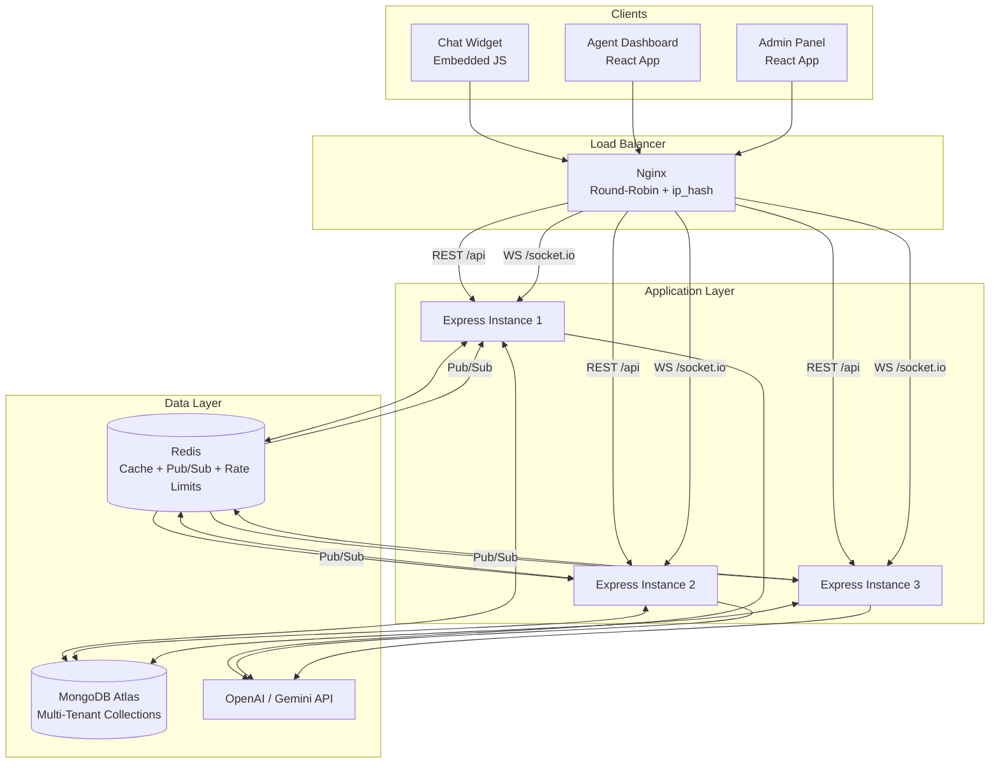
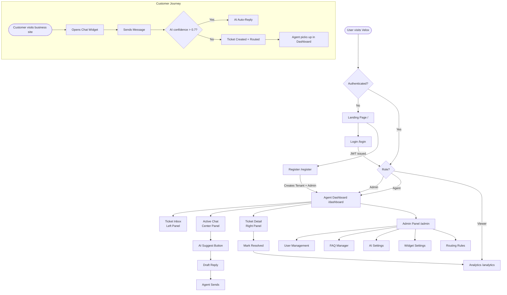
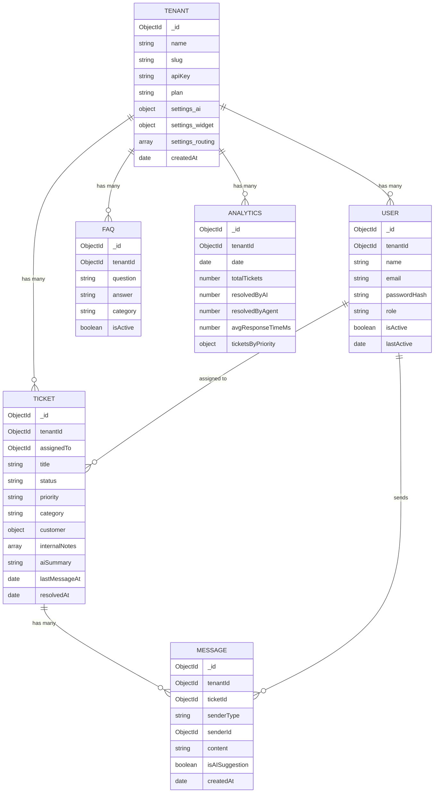
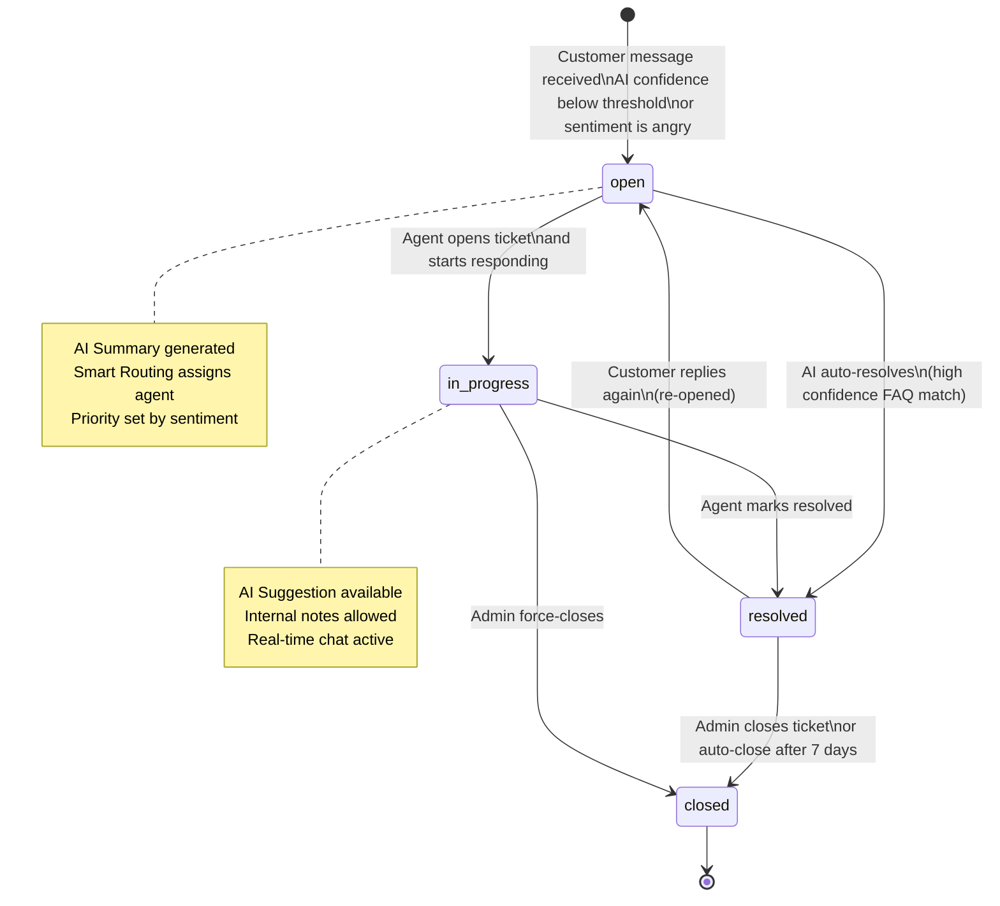
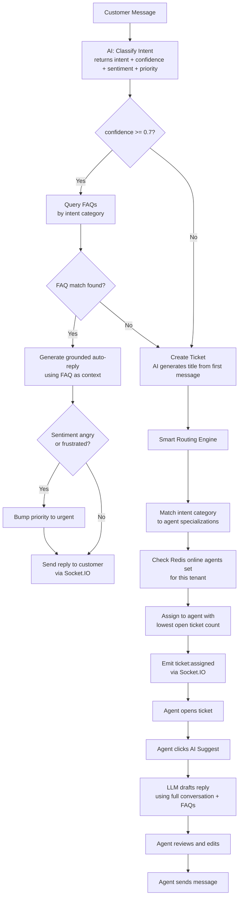
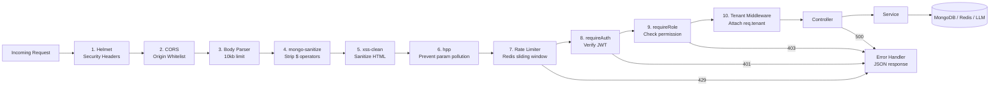
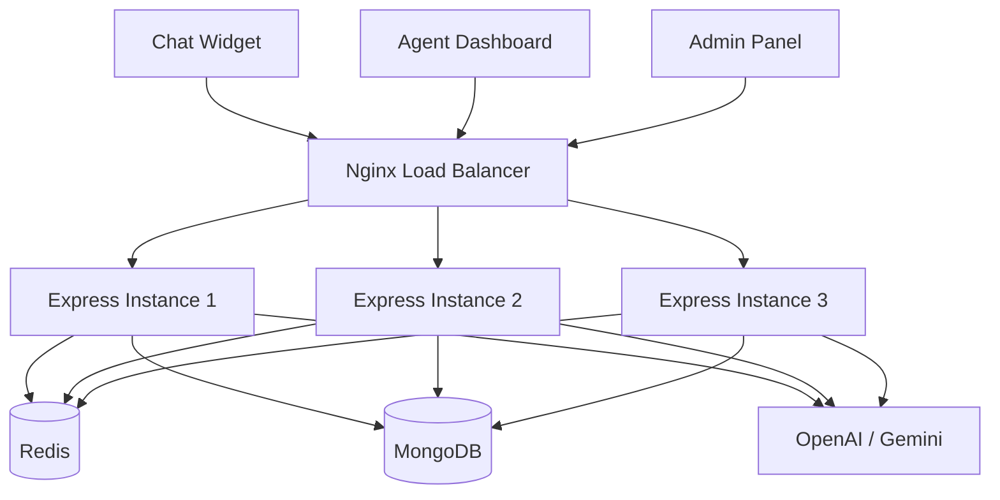

# VELOX — Implementation Plan
**AI Customer Support Platform | Multi-Tenant SaaS | Problem Statement #1**

> Intercom + Zendesk + AI Copilot — hackathon-executable, production-grade, security-hardened.

---

## Table of Contents
0. [Diagrams & Maps](#diagrams--maps)
1. [What We're Building](#what-were-building)
2. [Tech Stack](#tech-stack)
3. [Architecture](#architecture)
4. [Features](#features)
5. [Pages](#pages)
6. [Backend Team](#backend-team)
7. [Frontend Team](#frontend-team)
8. [Shared Reference](#shared-reference)
9. [Sprint Plan](#sprint-plan)
10. [Deployment](#deployment)
11. [Testing](#testing)
12. [Demo & Pitch](#demo--pitch)
13. [Submission](#submission)

---

# Diagrams & Maps

## 1. System Architecture



---

## 2. App User Flow



---

## 3. Database Schema Relationships



---

## 4. Ticket Lifecycle



---

## 5. AI Decision Flow



---

## 6. Request Middleware Pipeline



---

# What We're Building

A multi-tenant platform where businesses embed a chat widget on their site. AI auto-resolves simple customer queries from a knowledge base, creates tickets for complex ones, routes them to human agents with AI-drafted replies, and surfaces analytics on everything.

### Why We Win

| Average Team | Velox |
|---|---|
| Basic chat + AI reply | AI routing + agent productivity + clean UX |
| Single-tenant | Multi-tenant with strict data isolation |
| No scaling story | Docker + Nginx + Redis Pub/Sub — 3 Node instances |
| Basic Helmet | Full chain: CSP, HSTS, rate limiting, NoSQL sanitization |
| Plain REST | REST + WebSockets via Socket.IO |

### User Roles

| Role | What they do |
|------|-------------|
| Admin | Creates workspace, manages team, configures AI, views analytics |
| Agent | Handles assigned tickets, uses AI suggestions, adds internal notes |
| Customer | Chats via embedded widget, no login required |
| Viewer | Read-only access to dashboards |

---

# Tech Stack

| Layer | Choice | Reason |
|-------|--------|--------|
| Frontend | React + Vite | Fast dev, hackathon standard |
| Styling | Vanilla CSS with design tokens | Neo-Brutalism compliance, full control |
| State | Redux Toolkit | Hackathon requirement |
| Real-time client | Socket.IO Client | Auto-reconnect, room-based |
| Backend | Node.js + Express | MERN requirement |
| Database | MongoDB + Mongoose | Document-based, multi-tenant friendly |
| Cache + Pub/Sub | Redis (ioredis) | Sessions, rate limiting, Socket.IO adapter |
| Security | Helmet + middleware chain | 11 headers, CSP, HSTS |
| AI | OpenAI GPT-4o-mini or Gemini | Cloud LLM, no local models |
| Containers | Docker + Docker Compose | Multi-instance orchestration |
| Load balancer | Nginx | Round-robin + WebSocket upgrade |
| Frontend deploy | Vercel | Free tier |
| Backend deploy | Render / Railway | Free tier |
| DB host | MongoDB Atlas M0 | Free, Mumbai region |
| Redis host | Redis Cloud free tier | AOF persistence |

---

# Architecture

## System Diagram



## Request Flow — The Happy Path

```
1. Customer opens widget → Socket.IO connects with tenantId (from API key)
2. Customer sends message → hits Express via WebSocket
3. AI classifies message → returns { intent, confidence, sentiment, priority }
4. confidence > 0.7? → AI queries FAQs → generates grounded reply → sends back
5. confidence < 0.7? → ticket created → routing engine assigns to agent
6. Agent gets ticket:assigned event → dashboard inbox updates in real-time
7. Agent opens ticket → AI pre-drafts a suggested reply based on conversation
8. Agent reviews, edits, sends → customer sees it instantly via WebSocket
9. Ticket resolved → analytics engine logs all metrics
```

## Middleware Stack (per request, in order)

```
Request → Helmet → CORS → Body limit (10kb) → mongo-sanitize → xss-clean
       → hpp → Rate limiter → requireAuth → requireRole → tenant middleware
       → Controller → Service → MongoDB / Redis / LLM
```

---

# Features

## F1 — Multi-Tenant Architecture
**Priority: Critical**

Every document in every collection stores a `tenantId`. The tenant middleware extracts this from the decoded JWT and attaches it to `req.tenant`. Every single Mongoose query must filter by `{ tenantId: req.tenant }` — no exceptions. This is the #1 security concern.

- Register creates a Tenant document + first Admin user atomically
- Widget connections authenticate via API key which maps to a tenantId
- Index every collection on `tenantId` — it appears in every query

## F2 — Authentication & RBAC
**Priority: Critical**

- Register: creates Tenant + Admin user in one call, returns JWT
- Login: validates credentials, issues access token (15 min, in-memory) + refresh token (7 days, httpOnly cookie)
- JWT payload: `{ userId, tenantId, role }`
- Passwords: bcrypt, 12 rounds
- Logout: refresh token blacklisted in Redis with TTL

**RBAC Matrix:**

| Action | Admin | Agent | Viewer |
|--------|:-----:|:-----:|:------:|
| View Dashboard | Y | Y | Y |
| Handle Tickets | Y | Y | N |
| Send Messages | Y | Y | N |
| Manage Users | Y | N | N |
| Manage FAQs | Y | N | N |
| Configure AI | Y | N | N |
| View Analytics | Y | N | N |
| Assign Tickets | Y | N | N |

## F3 — Real-Time Chat
**Priority: Critical**

Socket.IO with Redis adapter (`@socket.io/redis-adapter`) for multi-instance delivery. Each ticket is a Socket.IO room. Chat history loads via REST on page open; live updates via WebSocket thereafter. Typing indicators are broadcast but never persisted. Widget customers use a `sessionToken` in localStorage — no login required.

## F4 — Ticketing System
**Priority: Critical**

Ticket lifecycle: `open → in-progress → resolved → closed`

When AI confidence is below threshold or sentiment is angry, a ticket is created automatically. AI generates the title from the first message. Properties: status, priority (AI-assigned from sentiment), category (AI-classified intent), assigned agent, customer info, internal notes (agent-only), AI summary.

## F5 — AI Support Assistant
**Priority: Critical — Core Differentiator**

Four capabilities:

| Capability | When it runs | What it does |
|-----------|-------------|--------------|
| Intent Classification | Every customer message | Returns intent, confidence, sentiment, priority |
| Auto-Reply | confidence > 0.7, intent matches FAQ | Generates FAQ-grounded response, sends to customer |
| Agent Suggestion | Agent clicks "AI Suggest" | Drafts reply from full conversation + FAQs |
| Summarization | Agent clicks "AI Summarize" | 2-3 sentence summary, stored on ticket |

**Smart Routing (when ticket is created):**
1. Match intent category to agent specializations (admin-configured)
2. If sentiment is angry/frustrated — bump priority to urgent
3. Query Redis for online agents in this tenant
4. Assign to the available agent with lowest open ticket count

**Anti-hallucination:** AI is always grounded in the tenant's FAQ data. If it cannot answer from context, it outputs `{ escalate: true }` and a ticket is created. Confidence thresholds are configurable per tenant. Agent suggestions are drafts only — never auto-sent.

## F6 — Agent Dashboard
**Priority: Critical**

Three-panel layout: Ticket Inbox (left) | Active Chat Thread (center) | Ticket Details (right)

- Inbox: filter by Assigned to Me / Unassigned / Urgent / All Open. Each card shows customer name, last message preview, priority badge, time since last activity
- Chat: message bubbles color-coded by sender. AI messages have dashed border and sparkle icon. Typing indicator animates in real-time
- Details: status/priority dropdowns, agent assignment, internal notes, AI Summarize button

## F7 — Admin Panel
**Priority: Critical**

Tabbed interface with five sections:

| Tab | What it does |
|-----|-------------|
| Users | Invite agents, change roles, deactivate accounts |
| FAQ Manager | CRUD for knowledge base. These entries feed the AI directly |
| AI Settings | Toggle auto-reply, set confidence threshold, tone, model |
| Widget Settings | Customize widget colors, greeting, get embed script |
| Routing Rules | Map intent categories to specific agents |

## F8 — Analytics Dashboard
**Priority: High**

| Metric | Display |
|--------|---------|
| Total Tickets | Stat card with trend |
| AI Resolution Rate | Target >= 40% |
| Avg Response Time | Target < 2s for AI |
| Avg Resolution Time | Stat card |
| Ticket Volume Over Time | Line chart (7/30 day toggle) |
| Tickets by Priority | Bar chart |
| Agent Performance | Table: name, resolved, avg time, online status |

## F9 — Embeddable Chat Widget
**Priority: Critical**

A standalone React component served as an embeddable script. Businesses add one `<script>` tag with their API key. Widget has fully scoped CSS (shadow DOM), connects via Socket.IO with the API key, manages customer sessions via localStorage. Features: minimize/maximize, unread badge, typing indicator, timestamps.

---

# Pages

| Route | Access | What's on it |
|-------|--------|-------------|
| `/` | Public | Landing — hero, How It Works, feature cards, comparison table |
| `/login` | Public | Email + password, link to register |
| `/register` | Public | Business name, name, email, password — creates tenant + admin |
| `/dashboard` | Agent+ | Three-panel: Ticket Inbox + Chat + Ticket Details |
| `/admin` | Admin | Tabbed: Users, FAQs, AI Settings, Widget, Routing |
| `/analytics` | Admin | Stat cards + charts + agent table |
| `/settings` | Auth | Edit profile, change password, logout |
| Widget (embedded) | Public | Floating chat bubble → chat window |
---

# Backend Team
**Akshat & Mayank — Node.js, Express, MongoDB, Redis, AI, Docker, Nginx**

---

## Folder Structure

```
backend/
├── src/
│   ├── config/
│   │   ├── db.js               MongoDB connection with retry logic
│   │   ├── redis.js            ioredis client setup
│   │   └── env.js              dotenv loader — fails fast if vars missing
│   ├── middleware/
│   │   ├── auth.js             Verifies JWT, attaches req.user
│   │   ├── rbac.js             requireRole('admin') — checks req.user.role
│   │   ├── tenant.js           Extracts tenantId from JWT, attaches req.tenant
│   │   ├── rateLimiter.js      Redis-backed sliding window rate limiter
│   │   ├── security.js         Helmet + CORS + mongo-sanitize + xss + hpp
│   │   ├── validate.js         Joi/Zod schema validation per route
│   │   └── errorHandler.js     Global error handler — consistent JSON format
│   ├── models/
│   │   ├── Tenant.js
│   │   ├── User.js
│   │   ├── Ticket.js
│   │   ├── Message.js
│   │   ├── FAQ.js
│   │   └── Analytics.js
│   ├── routes/
│   │   ├── auth.routes.js
│   │   ├── ticket.routes.js
│   │   ├── chat.routes.js
│   │   ├── admin.routes.js
│   │   ├── ai.routes.js
│   │   ├── analytics.routes.js
│   │   └── widget.routes.js
│   ├── controllers/            One file per route group, thin — calls services
│   ├── services/
│   │   ├── ai.service.js       LLM integration — classify, suggest, summarize, auto-reply
│   │   ├── routing.service.js  Smart ticket routing logic
│   │   ├── cache.service.js    Redis get/set/del helpers with TTL
│   │   └── analytics.service.js  Aggregation pipeline builders
│   ├── socket/
│   │   ├── index.js            Socket.IO server + Redis adapter init
│   │   ├── auth.js             Socket auth middleware
│   │   ├── chatHandler.js      join, leave, send, typing events
│   │   └── notificationHandler.js  ticket:new, ticket:assigned events
│   ├── utils/
│   │   ├── generateToken.js    JWT sign/verify helpers
│   │   ├── prompts.js          All LLM prompt templates
│   │   └── apiKey.js           Widget API key generation and validation
│   └── server.js               Entry point — Express + Socket.IO + middleware chain
├── Dockerfile
├── .env.example
└── package.json
```

---

## Database Schemas

### Tenants

| Field | Type | Notes |
|-------|------|-------|
| `_id` | ObjectId | — |
| `name` | String | "Acme Corp" |
| `slug` | String | unique, indexed — "acme-corp" |
| `apiKey` | String | unique, indexed — for widget auth |
| `plan` | String | "free" / "pro" / "enterprise" |
| `settings.ai.enabled` | Boolean | default true |
| `settings.ai.model` | String | "gpt-4o-mini" |
| `settings.ai.tone` | String | "professional" / "friendly" / "concise" |
| `settings.ai.autoReply` | Boolean | default true |
| `settings.ai.confidenceThreshold` | Number | default 0.7 |
| `settings.widget.accentColor` | String | default "#00E676" |
| `settings.widget.greeting` | String | "Hi! How can we help?" |
| `settings.routing` | Array | `[{ category, assignTo: UserId }]` |
| `createdBy` | ObjectId | ref User |
| `createdAt` | Date | — |

**Indexes:** `{ slug: 1 }`, `{ apiKey: 1 }`

---

### Users

| Field | Type | Notes |
|-------|------|-------|
| `tenantId` | ObjectId | ref Tenant — in every query |
| `name` | String | — |
| `email` | String | unique per tenant |
| `passwordHash` | String | bcrypt 12 rounds |
| `role` | String | "admin" / "agent" / "viewer" |
| `isActive` | Boolean | default true (soft delete) |
| `lastActive` | Date | updated on each authenticated request |
| `refreshToken` | String | hashed, for validation |

**Indexes:** `{ tenantId: 1, email: 1 }` compound unique, `{ tenantId: 1, role: 1 }`

---

### Tickets

| Field | Type | Notes |
|-------|------|-------|
| `tenantId` | ObjectId | in every query |
| `title` | String | AI-generated from first message |
| `status` | String | "open" / "in-progress" / "resolved" / "closed" |
| `priority` | String | "low" / "medium" / "high" / "urgent" |
| `category` | String | AI-classified intent |
| `assignedTo` | ObjectId | ref User, nullable |
| `customer.name` | String | from widget or "Anonymous" |
| `customer.email` | String | optional |
| `customer.sessionToken` | String | widget session ID |
| `internalNotes` | Array | `[{ author, content, createdAt }]` — agent-only |
| `aiSummary` | String | AI-generated, updated on demand |
| `messageCount` | Number | denormalized for performance |
| `lastMessageAt` | Date | for inbox sort by recency |
| `resolvedAt` | Date | nullable |

**Indexes:** `{ tenantId: 1, status: 1 }`, `{ tenantId: 1, assignedTo: 1 }`, `{ tenantId: 1, createdAt: -1 }`

---

### Messages

| Field | Type | Notes |
|-------|------|-------|
| `tenantId` | ObjectId | — |
| `ticketId` | ObjectId | ref Ticket — indexed |
| `senderType` | String | "customer" / "agent" / "ai" |
| `senderId` | ObjectId | ref User, null for customers |
| `content` | String | — |
| `isAISuggestion` | Boolean | true if AI draft was accepted by agent |
| `createdAt` | Date | — |

**Indexes:** `{ ticketId: 1, createdAt: 1 }` compound — for paginated chat history

---

### FAQs

| Field | Type | Notes |
|-------|------|-------|
| `tenantId` | ObjectId | — |
| `question` | String | — |
| `answer` | String | — |
| `category` | String | used for intent-to-FAQ mapping |
| `isActive` | Boolean | default true |

**Indexes:** `{ tenantId: 1, category: 1 }`, `{ tenantId: 1, isActive: 1 }`

---

### Analytics (Daily Aggregates)

| Field | Type | Notes |
|-------|------|-------|
| `tenantId` | ObjectId | — |
| `date` | Date | truncated to day |
| `totalTickets` | Number | — |
| `resolvedByAI` | Number | — |
| `resolvedByAgent` | Number | — |
| `avgResponseTimeMs` | Number | — |
| `avgResolutionTimeMs` | Number | — |
| `ticketsByPriority` | Object | `{ low, medium, high, urgent }` |
| `ticketsByCategory` | Map | `{ "billing": 5, "technical": 3 }` |

**Indexes:** `{ tenantId: 1, date: -1 }`

---

## API Routes

### Auth — `/api/auth`

| Method | Endpoint | Auth | Description |
|--------|----------|------|-------------|
| POST | `/register` | No | Creates Tenant + Admin user, returns JWT |
| POST | `/login` | No | Returns access token + sets refresh cookie |
| POST | `/refresh` | No (cookie) | Issues new token pair, blacklists old |
| POST | `/logout` | Yes | Blacklists refresh token in Redis |
| GET | `/me` | Yes | Returns current user (no passwordHash) |
| PUT | `/profile` | Yes | Update name or email |
| PUT | `/password` | Yes | Change password (requires current password) |

---

### Tickets — `/api/tickets`

| Method | Endpoint | Auth | Description |
|--------|----------|------|-------------|
| GET | `/` | Agent+ | List tickets — query: `status`, `assignedTo`, `priority`, `page`, `limit`, `sort` |
| POST | `/` | Any | Create ticket + trigger AI classification + routing |
| GET | `/:id` | Agent+ | Ticket detail with populated assignedTo |
| PATCH | `/:id` | Agent+ | Update status, priority, assignment, category |
| POST | `/:id/assign` | Admin | Assign to agent |
| POST | `/:id/notes` | Agent+ | Add internal note (agent-only) |
| DELETE | `/:id` | Admin | Soft delete (sets status to closed) |

---

### Chat — `/api/chat`

| Method | Endpoint | Auth | Description |
|--------|----------|------|-------------|
| POST | `/:ticketId/messages` | Any | Send message — persists to DB + broadcasts via Socket.IO |
| GET | `/:ticketId/messages` | Agent+ | Paginated history, sorted ascending by createdAt |

---

### AI — `/api/ai`

| Method | Endpoint | Auth | Description |
|--------|----------|------|-------------|
| POST | `/classify` | Internal | Classify message intent → `{ intent, confidence, sentiment, priority }` |
| POST | `/suggest-reply` | Agent+ | Load conversation + FAQs → return draft reply |
| POST | `/summarize/:ticketId` | Agent+ | Summarize thread → update ticket.aiSummary |
| POST | `/auto-reply` | Internal | FAQ-grounded auto-reply for customer |

---

### Admin — `/api/admin`

| Method | Endpoint | Auth | Description |
|--------|----------|------|-------------|
| GET | `/users` | Admin | List all users in tenant |
| POST | `/users/invite` | Admin | Create agent/viewer account |
| PATCH | `/users/:id/role` | Admin | Change role |
| PATCH | `/users/:id/status` | Admin | Activate / deactivate |
| GET/POST | `/faqs` | Admin | List / create FAQs |
| PUT/DELETE | `/faqs/:id` | Admin | Update / delete FAQ |
| GET | `/settings` | Admin | All tenant settings |
| PUT | `/settings/ai` | Admin | Update AI config |
| PUT | `/settings/widget` | Admin | Update widget config |
| PUT | `/settings/routing` | Admin | Update routing rules |

---

### Analytics — `/api/analytics`

All routes: Admin only. All accept `?from=YYYY-MM-DD&to=YYYY-MM-DD`.

| Method | Endpoint | Returns |
|--------|----------|---------|
| GET | `/overview` | Stat card totals and averages |
| GET | `/trends` | Ticket volume over time array |
| GET | `/agents` | Per-agent performance stats |
| GET | `/categories` | Tickets grouped by category |

---

### Widget — `/api/widget`

| Method | Endpoint | Auth | Description |
|--------|----------|------|-------------|
| GET | `/config/:apiKey` | None (public) | Widget display config — greeting, colors |
| POST | `/session` | API key | Create or resume customer session |

---

## Socket.IO Events

**Connection auth:**
- Agents connect with `{ auth: { token: "<JWT>" } }`
- Widget connects with `{ auth: { apiKey: "tk_...", sessionToken: "sess_..." } }`

### Client to Server

| Event | Payload | Description |
|-------|---------|-------------|
| `chat:join` | `{ ticketId }` | Join a ticket room |
| `chat:leave` | `{ ticketId }` | Leave a ticket room |
| `chat:send` | `{ ticketId, content, senderType }` | Send message — server persists + broadcasts |
| `chat:typing` | `{ ticketId }` | Broadcast typing indicator — never persisted |
| `agent:status` | `{ status }` | "online" or "away" — updates Redis set |

### Server to Client

| Event | Payload | Trigger |
|-------|---------|---------|
| `chat:message` | `{ message }` | New message in ticket room |
| `chat:typing` | `{ ticketId, user }` | Someone is typing |
| `ticket:new` | `{ ticket }` | New ticket created — broadcast to all tenant agents |
| `ticket:updated` | `{ ticket }` | Status/priority/assignment changed |
| `ticket:assigned` | `{ ticket, agentId }` | Assigned to specific agent |
| `notification:new` | `{ type, data }` | General notification |
| `ai:suggestion` | `{ ticketId, suggestion }` | AI suggestion ready |
| `ai:auto-reply` | `{ ticketId, message }` | AI sent auto-reply to customer |

---

## AI System Design

### Decision Flow

```
Customer message arrives
        |
        v
    [Classify via LLM]
        |
        v
  confidence >= 0.7?
   Yes          No
    |            |
    v            v
[FAQ match?]  [Create Ticket]
  Yes  No       |
   |    |       v
   |    |   [Smart Routing]
   v    v       |
[Auto  [Esc-   v
Reply] alate] [Assign Agent]
```

### Prompt Design

All four prompts live in `utils/prompts.js`. Here is what each must contain:

**Classification prompt** — Provide: tenant name, list of FAQ categories as labels. Ask for: intent, confidence (0.0-1.0), sentiment (positive/neutral/frustrated/angry), suggested priority. Request JSON response.

**Auto-reply prompt** — Provide: tenant name, tone setting, FAQ answers filtered by classified intent, last 5 messages as context. Instruct: only use provided context; if unable to answer, return `{ escalate: true }`; never invent information.

**Agent suggestion prompt** — Provide: tenant name, full ticket conversation, relevant FAQs, ticket category and priority. Ask for a professional draft reply. Frame it as a draft for the agent to review, not a final send.

**Summarization prompt** — Provide: all messages in the ticket. Ask for: 2-3 sentences covering what the customer needed, what was done, and current status.

---

## Security

### Middleware Chain (order is critical)

Apply in this exact order in `server.js` before mounting any routes:

1. `helmet()` — sets 11 security headers including X-Frame-Options, X-Content-Type-Options
2. `helmet.contentSecurityPolicy()` — restrict script/style/font/connect sources to known origins
3. `helmet.hsts()` — enforce HTTPS for 1 year including subdomains
4. `cors()` — whitelist only the frontend URL and widget URL; require credentials
5. `express.json({ limit: '10kb' })` — reject oversized payloads
6. `mongoSanitize()` — strip `$` and `.` operators from body/query/params
7. `xss()` — sanitize HTML entities in user input
8. `hpp()` — prevent HTTP parameter pollution
9. Global rate limiter — 100 req/min per IP
10. Auth-specific rate limiter on `/api/auth` — 5 req/min per IP

### Attack Coverage

| Attack | Defense |
|--------|---------|
| XSS | Helmet CSP blocks inline scripts + `xss-clean` sanitizes input + React escapes JSX |
| NoSQL Injection | `express-mongo-sanitize` strips `$gt`, `$ne`, `$or` operators |
| Brute Force | Redis rate limiter: 5 req/min on auth routes → 429 |
| DDoS | App-level rate limiter + Nginx `limit_req_zone` and `limit_conn_zone` |
| CSRF | SameSite=Strict cookie + CORS origin whitelist |
| JWT Theft | Access token in-memory only (15 min). Refresh token httpOnly cookie. Logout blacklists in Redis |
| Cross-Tenant Data Leak | Every Mongoose query filtered by `tenantId: req.tenant` — #1 audit target |
| Large Payload | `express.json({ limit: '10kb' })` |
| Clickjacking | `X-Frame-Options: DENY` via Helmet |

### JWT Storage Strategy

| Token | Storage | Expiry | Notes |
|-------|---------|--------|-------|
| Access | Redux store (in-memory) | 15 min | Never localStorage. Sent as `Authorization: Bearer` |
| Refresh | httpOnly Secure SameSite=Strict cookie | 7 days | Unreadable by JS |
| Blacklist | Redis key `bl:<jti>` | Matches token TTL | Checked in auth middleware before JWT verification |

---

## Horizontal Scaling

### Why It's Needed

With a single Node.js instance, Socket.IO works fine — all clients share one process. With 3 instances behind Nginx, Client A (on Instance 1) and Client B (on Instance 3) can't communicate without a shared message bus. Redis is that bus.

### Redis Pub/Sub for Socket.IO

Configure Socket.IO with `@socket.io/redis-adapter`. Create two Redis clients (pub + sub). When Instance 1 receives a `chat:send`, it saves the message and emits `chat:message`. The Redis adapter publishes this — Instances 2 and 3 subscribe, receive it, and deliver to their local connected clients. Zero messages lost.

### Docker Compose Setup

Orchestrate these 6 services:
- `nginx` — exposed on port 80, proxies to the three API instances
- `api-1`, `api-2`, `api-3` — identical Express builds, each with a unique `INSTANCE_ID` env var. Use YAML anchors (`&api-base`) to avoid repetition
- `mongo` — MongoDB 7 with volume mount
- `redis` — Redis 7 Alpine with AOF persistence enabled

### Nginx Configuration

Two location blocks:
- `/api/` — standard round-robin proxy. Set `X-Real-IP` and `X-Forwarded-For` headers so the Node app sees the actual client IP for rate limiting
- `/socket.io/` — requires `Upgrade` and `Connection: upgrade` headers. Use `ip_hash` for sticky sessions during Socket.IO long-polling fallback. Rate limiting does not apply here

Also define `limit_req_zone` and `limit_conn_zone` directives in Nginx for connection-level DDoS protection.

### Verifying It Works

1. `docker-compose up --build` — 3 instances + Redis + Mongo + Nginx
2. Log into two different browsers as two different agents
3. Open the same ticket in both browsers
4. Send a message from Browser 1 — it should appear instantly in Browser 2
5. Check Docker logs to confirm the two requests hit different instance IDs
6. Run `docker-compose stop api-2` — app should continue working on instances 1 and 3

---

## Redis Strategy

| Purpose | Key Pattern | TTL |
|---------|-------------|-----|
| JWT blacklist | `bl:<jti>` | Remaining token life |
| Rate limiting | `rl:<ip>:<endpoint>` | 1 min window |
| Tenant config cache | `tenant:<id>:config` | 5 min |
| Ticket list cache | `tenant:<id>:tickets:page:<n>` | 30 sec |
| FAQ cache per category | `tenant:<id>:faqs:<category>` | 5 min |
| Analytics cache | `tenant:<id>:analytics:<range>` | 2 min |
| Online agents | `tenant:<id>:agents:online` (Set) | No expiry — updated by agent:status |
| Socket.IO Pub/Sub | Managed by adapter internally | — |

**Invalidation:**
- On FAQ create/update/delete: invalidate `tenant:<id>:faqs:*`
- On ticket status change: invalidate matching ticket cache keys
- Ticket list and analytics caches expire naturally by TTL

---

## Backend Task List

| # | Task | Priority | Est. Hours |
|---|------|----------|------------|
| B1 | Express project setup, folder structure, dotenv, env validation | Critical | 2h |
| B2 | MongoDB connection with retry + all 6 Mongoose models | Critical | 3h |
| B3 | Auth: register (Tenant+User), login, JWT, refresh, `/me`, logout | Critical | 6h |
| B4 | Tenant middleware — extract tenantId from JWT, attach req.tenant | Critical | 1h |
| B5 | Ticket CRUD — list (paginated+filtered), create, get, update, notes | Critical | 5h |
| B6 | Chat messages — send (persist+broadcast), paginated history | Critical | 4h |
| B7 | Socket.IO server setup with Redis adapter + socket auth middleware | Critical | 5h |
| B8 | Socket event handlers — chatHandler, notificationHandler | Critical | 4h |
| B9 | AI service — intent classification (LLM call + JSON parse) | Critical | 4h |
| B10 | AI service — FAQ-grounded auto-reply + escalation fallback | Critical | 4h |
| B11 | AI service — agent suggestion endpoint | High | 3h |
| B12 | AI service — conversation summarization | High | 2h |
| B13 | Smart routing service — category mapping + sentiment + availability | High | 4h |
| B14 | Admin endpoints — users, FAQ CRUD, all settings | High | 5h |
| B15 | Analytics endpoints — aggregation pipelines | High | 4h |
| B16 | Widget endpoints — public config + session | High | 2h |
| B17 | Security middleware chain — full Helmet + sanitize + xss + hpp | Critical | 3h |
| B18 | Redis-backed rate limiter — global + auth-specific | Critical | 2h |
| B19 | Redis client + cache service helpers + token blacklist functions | Critical | 2h |
| B20 | Global error handler — consistent JSON, async wrapper | Critical | 1h |
| B21 | Input validation — Joi/Zod schemas for all endpoints | High | 3h |
| B22 | Dockerfile — multi-stage build | Critical | 2h |
| B23 | Docker Compose — 3 instances + Redis + Mongo + Nginx, YAML anchors | Critical | 3h |
| B24 | Nginx config — round-robin REST + ip_hash WebSocket + rate limits | Critical | 2h |
| B25 | Deploy to Render/Railway + configure env vars + verify live URL | Critical | 3h |
| B26 | MongoDB compound indexes on all collections, verify with .explain() | High | 1h |
| B27 | Load test with autocannon — all major endpoints + rate limiter check | High | 2h |
| B28 | README — setup steps, env vars, architecture, Docker instructions | Critical | 2h |

**Suggested split:** Akshat owns B3, B5-B13 (auth, tickets, chat, WebSocket, AI). Mayank owns B1-B2, B17-B25 (infra, security, Docker, Nginx, deployment).

---

## Backend Notes

- Start with B1, B2, B17, B19, B20 before anything else. Nothing works without the foundation.
- **Tenant isolation is the single biggest security risk.** Before submission, grep every Mongoose `find`, `findOne`, `findById`, `updateOne`, `deleteOne` in controllers and confirm each one includes `tenantId: req.tenant` in the filter. If even one leaks, the judges will find it.
- Test the Redis adapter on Day 1, not Day 2. Set up Docker with 2 instances immediately after B7 and verify cross-instance messaging works before building AI on top.
- Use `express-async-errors` or wrap all controller functions in a try/catch to avoid unhandled promise rejections crashing the server.
---

# Frontend Team
**Nikhil & Noor — React, Redux Toolkit, Socket.IO Client, Neo-Brutalism CSS**

---

## Folder Structure

```
frontend/
├── public/
│   └── widget-loader.js        Embeddable script — creates container, loads widget
├── src/
│   ├── app/
│   │   ├── store.js            Redux configureStore with all slices
│   │   ├── App.jsx             Router + layout wrapper
│   │   └── index.css           Global resets + font imports
│   ├── design/                 Neo-Brutalism Design System
│   │   ├── tokens.css          All CSS custom properties
│   │   ├── Button.jsx + .css
│   │   ├── Card.jsx + .css
│   │   ├── Input.jsx + .css
│   │   ├── Badge.jsx
│   │   ├── Modal.jsx
│   │   ├── Sidebar.jsx
│   │   ├── Toast.jsx
│   │   └── Skeleton.jsx
│   ├── features/
│   │   ├── auth/
│   │   │   ├── authSlice.js
│   │   │   ├── Login.jsx + .css
│   │   │   ├── Signup.jsx + .css
│   │   │   └── ProtectedRoute.jsx
│   │   ├── chat/
│   │   │   ├── chatSlice.js
│   │   │   ├── ChatWindow.jsx + .css
│   │   │   ├── MessageBubble.jsx
│   │   │   ├── MessageInput.jsx
│   │   │   ├── TypingIndicator.jsx
│   │   │   └── AISuggestionPanel.jsx
│   │   ├── tickets/
│   │   │   ├── ticketSlice.js
│   │   │   ├── TicketInbox.jsx + .css
│   │   │   ├── TicketCard.jsx
│   │   │   ├── TicketDetail.jsx + .css
│   │   │   └── TicketFilters.jsx
│   │   ├── admin/
│   │   │   ├── adminSlice.js
│   │   │   ├── AdminLayout.jsx
│   │   │   ├── UserManagement.jsx + .css
│   │   │   ├── FAQManager.jsx + .css
│   │   │   ├── AISettings.jsx
│   │   │   └── WidgetSettings.jsx
│   │   ├── analytics/
│   │   │   ├── analyticsSlice.js
│   │   │   ├── AnalyticsDashboard.jsx + .css
│   │   │   ├── StatCard.jsx
│   │   │   └── Charts.jsx
│   │   ├── widget/
│   │   │   ├── WidgetContainer.jsx
│   │   │   ├── WidgetChat.jsx
│   │   │   └── Widget.css
│   │   └── landing/
│   │       ├── LandingPage.jsx + .css
│   │       ├── HeroSection.jsx
│   │       ├── FeatureCards.jsx
│   │       └── HowItWorks.jsx
│   ├── hooks/
│   │   ├── useSocket.js        Socket.IO lifecycle — connect, events, cleanup
│   │   ├── useAuth.js          Auth state helpers
│   │   └── useDebounce.js      For search inputs and typing indicators
│   ├── utils/
│   │   ├── api.js              Axios instance — JWT interceptor + auto-refresh on 401
│   │   └── constants.js        Role enums, status enums, priority colors
│   └── main.jsx
├── vite.config.js
└── package.json
```

---

## Redux Store Structure

| Slice | State Shape |
|-------|-------------|
| `authSlice` | `{ user, token, status: 'idle/loading/succeeded/failed', error }` |
| `chatSlice` | `{ activeTicketId, messages: { [ticketId]: [] }, typing: { [ticketId]: [...] }, connected }` |
| `ticketSlice` | `{ tickets: [], filters: { status, priority, assignedTo }, pagination, selectedTicket }` |
| `adminSlice` | `{ users: [], faqs: [], aiSettings, widgetConfig, routingRules }` |
| `analyticsSlice` | `{ overview, trends: [], agentStats: [], status }` |
| `uiSlice` | `{ sidebarOpen, activeModal, notifications: [] }` |

All async calls use `createAsyncThunk`. The Axios instance in `utils/api.js` attaches the token from store on every request and auto-calls the refresh endpoint on 401 before retrying.

---

## Neo-Brutalism Design System

### Design Principles

This is not a clean modern SaaS look. It's structural, bold, and intentional. Judges remember it.

- **Zero border-radius** — square corners everywhere
- **No soft drop shadows** — only hard offset shadows at 0px blur
- **Thick visible borders** — 2px to 4px solid black
- **Pastel backgrounds** — lavender, yellow, green, pink, blue on a warm off-white base
- **Oversized bold typography** — uppercase headers, heavy font weight
- **Press animations on buttons** — simulate physical tactility

### Token Reference

| Token | Value | Used For |
|-------|-------|----------|
| `--nb-bg` | `#FFFDF7` | Warm off-white — main background |
| `--nb-bg-sidebar` | `#F5F0E8` | Sidebar background |
| `--nb-lavender` | `#E6E6FA` | Cards, containers |
| `--nb-yellow` | `#FFF59D` | Primary buttons, highlights |
| `--nb-green` | `#00E676` | AI elements, success states |
| `--nb-pink` | `#F8BBD0` | Badges, accents |
| `--nb-blue` | `#BBDEFB` | Info, input focus |
| `--nb-peach` | `#FFCCBC` | Warnings, high priority |
| `--nb-red` | `#FF5252` | Errors, urgent priority |
| `--nb-border-thin` | `2px solid #000` | Message bubbles, subtle separators |
| `--nb-border` | `3px solid #000` | Inputs, cards |
| `--nb-border-thick` | `4px solid #000` | Headers, primary containers |
| `--nb-shadow-sm` | `2px 2px 0px #000` | Pressed/hover state |
| `--nb-shadow-md` | `4px 4px 0px #000` | Buttons default |
| `--nb-shadow-lg` | `6px 6px 0px #000` | Cards, modals |
| `--nb-font-display` | Space Grotesk | All headings (import from Google Fonts) |
| `--nb-font-body` | Inter | Body text |
| `--nb-font-mono` | JetBrains Mono | Code, IDs, ticket numbers |

### Component Rules

**Button:** 3px black border, `--nb-shadow-md`. On hover: `translate(2px, 2px)` + `--nb-shadow-sm`. On active: `translate(4px, 4px)` + no shadow (fully pressed illusion). Background: yellow for primary, white for secondary, red for danger.

**Card:** 2px black border, `--nb-shadow-lg`, lavender background, 0px border-radius. No exceptions.

**Input:** 3px black border, `--nb-shadow-sm`. On focus: blue background, `--nb-shadow-md`. No outline.

**Priority Badges:**

| Priority | Background | Text |
|----------|-----------|------|
| Low | `--nb-blue` | Black |
| Medium | `--nb-yellow` | Black |
| High | `--nb-peach` | Black |
| Urgent | `--nb-red` | White |

**Message Bubbles:**

| Sender | Background | Border |
|--------|-----------|--------|
| Customer | `--nb-lavender` | 2px solid black |
| Agent | White | 2px solid black |
| AI | `--nb-green` tinted | 2px dashed black + sparkle icon |

**Layout separators:** Sidebar divided from main content by `3px solid black` vertical line. Panel separators the same.

**Typography rule:** Section headers are `font-size: 2rem`, `font-weight: 800`, `text-transform: uppercase`. No soft typography anywhere in the dashboard.

---

## Frontend Task List

| # | Task | Priority | Est. Hours |
|---|------|----------|------------|
| F1 | Vite + React init, install all dependencies | Critical | 1h |
| F2 | Design tokens — `tokens.css` with all CSS custom properties | Critical | 2h |
| F3 | Button component with press animation, all variants | Critical | 2h |
| F4 | Card component — thick border, offset shadow, variants | Critical | 1h |
| F5 | Input component — thick border, pastel focus, textarea variant | Critical | 1h |
| F6 | Badge, Modal, Toast, Skeleton, Dropdown components | Critical | 3h |
| F7 | Redux store with all 6 slice scaffolds | Critical | 3h |
| F8 | Axios API service — base URL, JWT interceptor, auto-refresh on 401 | Critical | 2h |
| F9 | Auth slice — login/register/getMe/logout thunks, loading+error state | Critical | 2h |
| F10 | Login page — form, validation, error display, link to register | Critical | 3h |
| F11 | Register page — business name, name, email, password fields, auto-redirect | Critical | 3h |
| F12 | ProtectedRoute — check auth, redirect to /login, skeleton while checking | Critical | 1h |
| F13 | App layout — sidebar + topbar + content area, responsive hamburger | Critical | 4h |
| F14 | Sidebar — role-based nav links, active state, stark vertical divider | Critical | 2h |
| F15 | useSocket hook — connect with JWT, event listeners, auto-reconnect, cleanup | Critical | 3h |
| F16 | Ticket slice — state shape, fetchTickets/updateTicket/assignTicket thunks | Critical | 3h |
| F17 | Ticket Inbox (left panel) — filter buttons, ticket cards, real-time updates | Critical | 5h |
| F18 | Ticket Detail (right panel) — status/priority dropdowns, agent selector, notes | Critical | 4h |
| F19 | Chat slice — messages map, typing indicators, fetchMessages thunk | Critical | 2h |
| F20 | Chat Window (center panel) — message list, auto-scroll, bubble components | Critical | 5h |
| F21 | Message Input — text field, send button, emits chat:send and chat:typing | Critical | 2h |
| F22 | AI Suggestion Panel — "AI Suggest" button, draft display, Accept/Edit/Dismiss | Critical | 3h |
| F23 | Message Bubble — styled per senderType, name + timestamp | Critical | 2h |
| F24 | Socket event wiring — chat:message / ticket:new / ticket:updated / notification:new → Redux | Critical | 3h |
| F25 | Admin layout — tabbed interface, visible to admin role only | High | 2h |
| F26 | User Management page — agent table, invite modal, role/status controls | High | 4h |
| F27 | FAQ Manager — searchable list, add/edit/delete forms | High | 4h |
| F28 | AI Settings page — auto-reply toggle, threshold slider, tone + model selector | High | 2h |
| F29 | Widget Settings page — color picker, greeting input, embed code copy | High | 2h |
| F30 | Analytics slice — overview/trends/agentStats thunks | High | 2h |
| F31 | Analytics Dashboard — 4 stat cards + trend indicators, agent table | High | 5h |
| F32 | Charts — Recharts LineChart + BarChart, thick strokes, flat fills, brutalist tooltips | High | 3h |
| F33 | Chat Widget — standalone React app, scoped CSS, Socket.IO via API key, localStorage session | Critical | 6h |
| F34 | Widget loader script — vanilla JS, creates iframe/shadow DOM, loads widget | Critical | 2h |
| F35 | Landing page — hero, How It Works, feature cards, comparison, CTA | High | 5h |
| F36 | Notification toasts — real-time, auto-dismiss after 5s | High | 2h |
| F37 | Profile/Settings page — edit name/email, change password, logout | Low | 2h |
| F38 | Responsive design pass — all pages at 320px, 768px, 1024px, 1440px | Critical | 4h |
| F39 | Loading and error states — skeletons, error boundaries, empty states | High | 3h |
| F40 | Dark mode — CSS property swap, toggle in sidebar, persist in localStorage | Low | 2h |
| F41 | Micro-animations — card hover, button press, typing dots, toast slide-in | High | 2h |

**Suggested split:** Nikhil owns F7-F24 (Redux store, auth, three-panel dashboard, real-time). Noor owns F2-F6 (design system), F25-F35 (admin, analytics, widget, landing).

---

## Frontend Notes

- **Start with F1-F8.** Design system + store + API layer = your foundation. Every page depends on these. Do not skip ahead.
- **Don't wait for the backend.** Mock API responses in `utils/api.js` from the start. Use the agreed request/response shapes from the API spec. Swap to real endpoints when backend delivers them.
- **Neo-Brutalism is non-negotiable.** The judges weight UI/UX heavily. Every component must follow the tokens. No rounded corners. No soft shadows. If it looks like a default Bootstrap component, it's wrong.
- **The three-panel dashboard is the product.** Spend more time here than anywhere else. The Inbox, Chat Window, and AI Suggestion Panel together are the "wow" moment for judges.
- Mock a realistic demo state — seed your Redux store with a few pre-created tickets and messages so the demo doesn't start on an empty screen.

---

# Shared Reference

## Sprint Plan (48-Hour Build)

| Phase | Hours | Goal |
|-------|-------|------|
| 1 — Foundation | 0–4h | Both teams unblocked. Backend: Express + DB + Redis. Frontend: design system + Redux + API layer |
| 2 — Core Build | 4–20h | Auth E2E. Tickets + Chat E2E. Real-time messaging works |
| 3 — AI Layer | 20–32h | Classification, auto-reply, suggestions, routing all working |
| 4 — Polish | 32–40h | Analytics, admin panel, widget, loading/error states, responsive |
| 5 — Security & Scaling | 40–44h | Docker + Nginx running. Security verified. Deployed live |
| 6 — Demo Prep | 44–48h | E2E tested. Pitch rehearsed. Submission ready |

### Phase 1 — Foundation (Hours 0-4)

| Task | Team |
|------|------|
| Express project setup + folder structure | Backend |
| MongoDB connection + all 6 Mongoose models | Backend |
| Redis client + cache helpers | Backend |
| Global error handler | Backend |
| Vite + React init + all dependencies | Frontend |
| Design tokens CSS file | Frontend |
| All base components (Button, Card, Input, Badge, Modal, Toast, Skeleton) | Frontend |
| Redux store + all slice scaffolds | Frontend |
| Axios instance + JWT interceptor | Frontend |

### Phase 2 — Core Build (Hours 4-20)

| Task | Team |
|------|------|
| Auth system — register, login, JWT, refresh, me, logout | Backend |
| Tenant middleware | Backend |
| Ticket CRUD + routes | Backend |
| Chat message controller + routes | Backend |
| Socket.IO server + Redis adapter | Backend |
| Chat + notification socket handlers | Backend |
| Full security middleware chain | Backend |
| Rate limiting | Backend |
| Auth slice + Login + Register pages | Frontend |
| Protected route | Frontend |
| App layout + Sidebar | Frontend |
| useSocket hook | Frontend |
| Ticket Inbox + Ticket Detail panels | Frontend |
| Chat Window + Message Input + Message Bubble | Frontend |
| Socket event wiring to Redux | Frontend |

### Phase 3 — AI Layer (Hours 20-32)

| Task | Team |
|------|------|
| AI classification service | Backend |
| AI auto-reply with FAQ grounding | Backend |
| AI agent suggestion endpoint | Backend |
| AI conversation summarization | Backend |
| Smart routing service | Backend |
| Admin user/FAQ/settings endpoints | Backend |
| AI Suggestion Panel in chat | Frontend |
| Admin layout + all 5 tabs | Frontend |
| Embeddable Chat Widget + loader script | Frontend |

### Phase 4 — Polish (Hours 32-40)

| Task | Team |
|------|------|
| Analytics aggregation endpoints | Backend |
| Widget config endpoint | Backend |
| Input validation on all endpoints | Backend |
| MongoDB compound indexes | Backend |
| Analytics Dashboard + Charts | Frontend |
| Landing page | Frontend |
| Notification toasts | Frontend |
| Profile/Settings page | Frontend |
| Responsive design pass | Frontend |
| Loading + error states | Frontend |
| Dark mode + micro-animations | Frontend |

### Phase 5 — Security & Scaling (Hours 40-44)

| Task | Team |
|------|------|
| Dockerfile multi-stage build | Backend |
| Docker Compose — 3 instances | Backend |
| Nginx config — load balancing + WebSocket | Backend |
| Deploy backend to Render/Railway | Backend |
| Load test with autocannon | Backend |
| Deploy frontend to Vercel | Frontend |
| Cross-browser testing | Frontend |
| Final UI audit | Frontend |

### Phase 6 — Demo Prep (Hours 44-48)

| Task | Team |
|------|------|
| E2E flow test — full widget to resolution journey | Both |
| README documentation | Backend |
| Demo rehearsal | Both |
| Record pitch video | Both |
| Social posts (X, LinkedIn, Instagram) | Both |
| BTS monologue/voiceover | Both |
| Discord submission | Both |

---

## Deployment

| Service | Platform | Config |
|---------|----------|--------|
| Frontend | Vercel | Build: `npm run build`, Output: `dist`, Env: `VITE_API_URL` |
| Backend | Render / Railway | Start: `node src/server.js`, Env vars: see `.env.example` |
| Database | MongoDB Atlas M0 | Mumbai region, connection string with `retryWrites=true&w=majority` |
| Redis | Redis Cloud free tier | AOF persistence enabled |
| Scaling demo | Docker Compose locally | `docker-compose up --build` — 3 instances + Redis + Mongo + Nginx |

Required environment variables for backend: `MONGODB_URI`, `REDIS_URL`, `JWT_SECRET`, `JWT_REFRESH_SECRET`, `OPENAI_API_KEY`, `FRONTEND_URL`, `WIDGET_URL`, `NODE_ENV`, `PORT`

---

## Testing

### Backend

| Test Type | Method |
|-----------|--------|
| API testing | Thunder Client or Postman — all endpoints |
| NoSQL injection | POST `/login` with `{ email: { "$gt": "" }, password: { "$gt": "" } }` — must fail |
| XSS | Send `<script>alert('xss')</script>` as a message — must be sanitized |
| Brute force | Hit `/login` 10 times rapidly — must get 429 after 5th |
| Security headers | `curl -I https://your-api-url` — verify Helmet headers present |
| Scaling | Open 2 browsers, send messages cross-instance, kill one instance and verify app continues |
| Load | `npx autocannon -c 100 -d 30 http://localhost/api/tickets` |

### Frontend

- Cross-browser: Chrome, Firefox, Safari
- Responsive: 320px, 768px, 1024px, 1440px
- Real-time: 2 tabs as different agents, verify message sync
- Widget: embed in a bare HTML file, run full chat flow

### E2E Demo Flow (Run Before Submission)

| Step | Expected Result |
|------|----------------|
| Open widget on test site | Greeting message appears |
| Customer asks simple question | AI auto-replies from FAQ within 2 seconds |
| Customer asks complex question | Ticket created automatically |
| Switch to Agent Dashboard | New ticket notification appears in real-time |
| Agent opens ticket | Chat history visible + AI summary shown |
| Agent clicks "AI Suggest" | Draft reply populated in input |
| Agent edits and sends | Customer sees reply in widget instantly |
| Agent marks ticket resolved | Analytics dashboard reflects the resolution |
| Admin opens FAQ Manager | Adds new FAQ entry |
| Customer asks same question | AI uses new FAQ for next conversation |

---

## Demo & Pitch

### Pitch Structure

| Segment | Duration | Script |
|---------|----------|--------|
| Problem | 30 sec | "40% of support tickets are repetitive FAQs. Agents waste hours. Businesses overspend on support that AI should handle." |
| Solution | 45 sec | "Velox is an AI-first, multi-tenant support platform. Embed our widget. AI resolves common queries instantly from your knowledge base. Complex issues escalate — AI creates the ticket, routes it to the right agent, and drafts the reply." |
| Demo | 60 sec | Live: widget → AI reply → escalation → agent dashboard → AI suggestion → resolution → analytics |
| Tech depth | 30 sec | "Multi-tenant data isolation. 3 horizontally-scaled Node instances behind Nginx. Redis Pub/Sub for WebSocket sync. Full Helmet + rate limiting + NoSQL injection prevention. All in Docker." |
| Impact | 15 sec | "Sub-2s AI responses. 40%+ query automation. Agents focus only on what needs a human." |

**Pitch line:** *"An AI-first support platform that kills repetitive queries while keeping humans in the loop for what actually matters."*

---

## Submission Checklist

### Required

- [ ] GitHub repository with clean commits
- [ ] Live deployment link (frontend + backend both accessible)
- [ ] Pitch video on Google Drive (public access)
- [ ] X (Twitter) post with pitch + link
- [ ] LinkedIn post with pitch + link
- [ ] Instagram post / story / reel
- [ ] BTS content — monologue or voiceover showing build process and thinking

### README Must Include

- [ ] Setup steps (clone, install, env vars, run)
- [ ] Features explanation
- [ ] Tech decisions (why each tool was chosen)
- [ ] Architecture diagram
- [ ] How to run Docker Compose for scaling demo

### Pre-Launch

- [ ] Auth E2E: register → login → protected route → token refresh → logout
- [ ] Real-time chat: widget → agent dashboard, messages sync in under 1 second
- [ ] AI auto-reply: sends FAQ-grounded response, not hallucinated
- [ ] AI suggestion: appears as a draft, not auto-sent
- [ ] Smart routing: ticket assigned to correct agent based on category
- [ ] Admin panel: all 5 tabs functional
- [ ] Analytics: charts render with real data from resolved tickets
- [ ] Security headers: verified via `curl -I` or securityheaders.com
- [ ] Rate limiting: `/login` returns 429 on 6th attempt within a minute
- [ ] Horizontal scaling: 3 Docker instances, cross-instance WebSocket delivery confirmed
- [ ] Responsive: tested at all 4 breakpoints
- [ ] Widget: embeds and functions on an external HTML page
- [ ] No console errors in production build

---

> This document is the single source of truth. If something is unclear, update the document — not a side channel. Every feature, page, task, endpoint, and event is here. No surprises.
